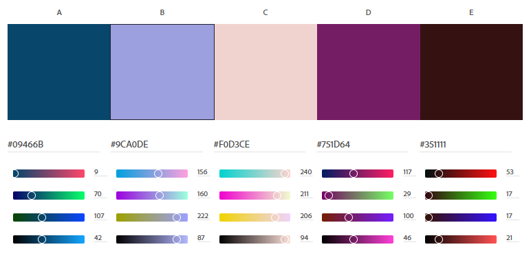
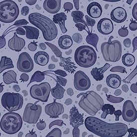
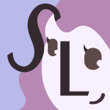

# Sarah Lopez: About Me

## **Introduction**

My name is Sarah Lopez. I'm a first year Web Development student at RVCC and this is my first big project. I have dabbled in coding here and there over the years, but I have never made something on this scale before.

 

## **Description**

This project was constructed over the course of a semester. Each week, a new Web Development topic would be introduced and would then be incorporated into the About Me page. These topics included:

#### _Adding HTML, Images & Links_

Introduction to basic HTML. The project begins as a blank page. An avatar and brief description are added.

#### _Adding Some Style_

Introduction to CSS and designing color schemes with accessibility in mind.

#### _Tell Me More_

Gallery section is added along with figcaptions.

#### _Responsive Design_

Adding a responsive design with media queries for users viewing the page on a phone, tablet, or desktop.

#### _Embedded Media_

An introduction to iframes. A video is added to the page.

#### _Web Forms_

A functioning Contact form is added and styled.

#### _Nav Bar_

A horizontal nav bar on the top of the page is added.

 

## **Article**

For the article section, I decided to research and write about animating SVG images. In the article, I use two examples. The first one is the avatar from the page's header, and the other one is a logo I designed myself in Visual Design I.

 

## **Color Scheme**

I decided to go with an analogous color scheme because they tend to be more soothing and harmonious than, say, a complementary color scheme. There's a lot of violet, peach, and blue.

**_Color 1:_**

RGB: 9, 70, 107

Hex: #09466B

 

**_Color 2:_**

RGB: 156, 160, 222

Hex: #9CA0DE

 

**_Color 3:_**

RGB: 240, 211, 206

Hex: #F0D3CE

 

**_Color 4:_**

RGB: 117, 29, 100

Hex: #751D64

 

**_Color 5:_**

RGB: 53, 17, 17

Hex: #351111

 

 

## **Background Image**

For the background, I decided to spice it up with a more personal touch. I scanned a watercolor illustration from my sketchbook into Photoshop, made it into a repeating pattern, and adjusted the colors so that they would match with the site. Although the page has nothing to do with food, the illustrative hand-drawn style of the background image reinforces the general laid-back and playful quality of this project.

 

## **Logo**

The Logo is something I put together in Illustrator. My goal was to take my initials and use the visual elements of typography to create an image. The S in my name represents a lock of hair and the L is a nose. The colors used in the logo reflect the colors used on the page.

 

## **Citations**

Avatar made with [Avataaars Generator](https://getavataaars.com/)

[Hamburger Icon](https://icons8.com/icon/82749/hamburger-menu) and [Close Icon](https://icons8.com/icon/43529/close) by [Icons8](https://icons8.com/)

 

#### _Article Sources_

[Dev Ed: Learn to Build an SVG Animation with CSS](https://www.youtube.com/watch?v=gWai7fYp9PY)

[Animating SVG with CSS by Chris Coyier](https://css-tricks.com/animating-svg-css/)

[Fireship: Make Awesome SCG Animations with CSS](https://www.youtube.com/watch?v=UTHgr6NLeEw)

## **License**

This project is licensed under a Creative Commons Attribution 4.0 International license.
